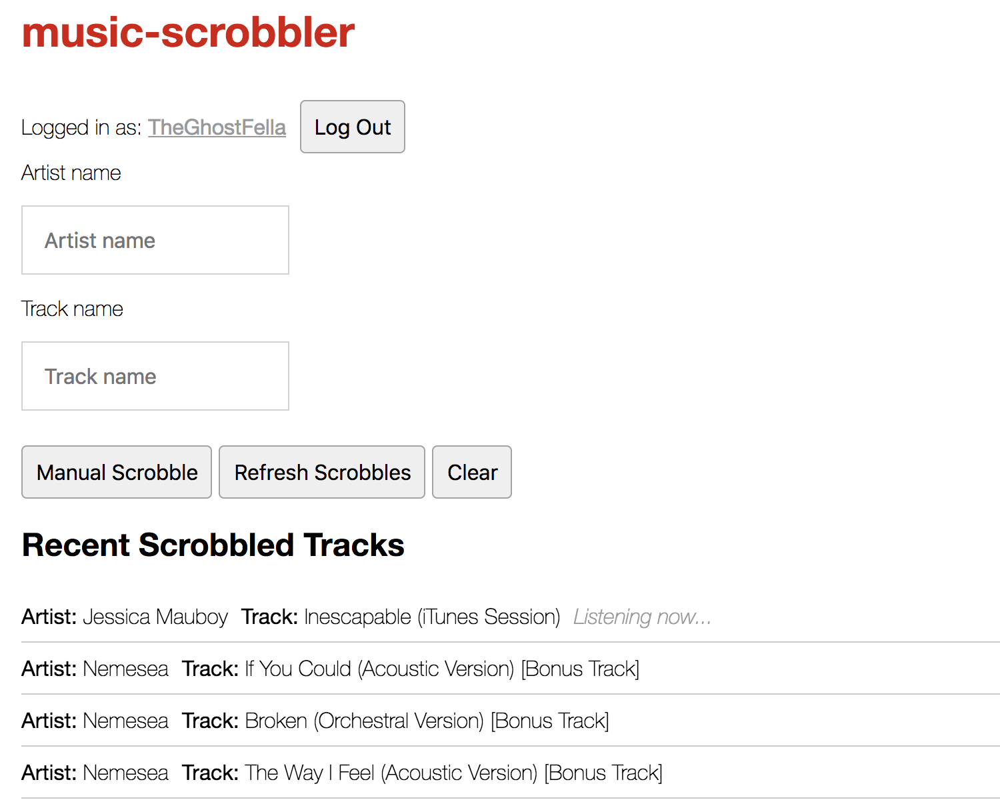

# music-scrobbler
music scrobbler using last.fm api - built with re-frame + re-agent in clojurescript
https://music-scrobbler.firebaseapp.com/




## Instructions
You will need a last fm api account set up before proceeding to use this web application.
http://www.last.fm/api/account/create

In db.cljs, add your `api-key` and `secret-key` and save.


## Development Mode

### Run application:

```
lein clean
lein figwheel dev
```

Figwheel will automatically push cljs changes to the browser.

Wait a bit, then browse to [http://localhost:3669](http://localhost:3669).

## Production Build


To compile clojurescript to javascript:

```
lein clean
lein cljsbuild once min
```
